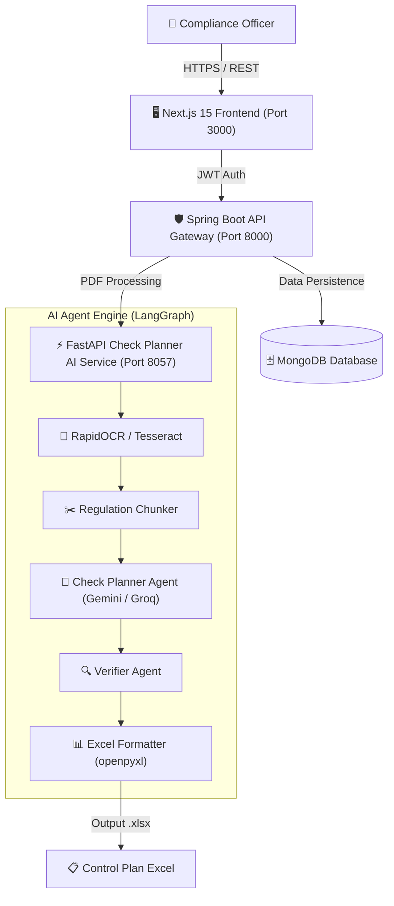

# CHECK-PLAN-GENERATOR-AGENTS


[](https://github.com/CDG-CAPITAL-FINANCE/CHECK-PLAN-GENERATOR-AGENTS/wiki)
[](docs/MONITORING_AND_QA.md)

---

<div align="center">


**AI-Driven Automated Control Plan Generation & Verification Platform for Financial Management Regulations**

[Architecture](#-architecture) • [Features](#-features) • [Installation](#-installation) • [Team](#-team-and-codeowners) • [Contributing](#-contributing)

</div>

---

## 📌 Executive Summary

**Check Plan Generator Agents** is an enterprise AI platform developed for **CDG Capital**. It automates the extraction, verification, and transformation of complex financial management regulations (*Règlements de Gestion*) into structured compliance control plans exported as Excel spreadsheets.

The platform utilizes a multi-agent **LangGraph** workflow coupled with OCR engines (**RapidOCR / PaddleOCR**), a **Spring Boot 3** security and API gateway, and a modern **Next.js 15** reactive frontend.

---

## 🏛️ Architecture & Tech Stack



### Core Technologies
- **AI Agent Engine**: Python 3.11, LangGraph, LangChain, Google Gemini API, Groq Llama 3
- **OCR Engine**: RapidOCR (PaddleOCR ONNX runtime) with Tesseract fallback
- **API Gateway & Auth**: Java 17, Spring Boot 3.5, Spring Security, JWT, MongoDB
- **Frontend App**: Next.js 15 (App Router), TailwindCSS, Radix UI, Framer Motion
- **DevOps & Infra**: Docker, Docker Compose, GitHub Actions CI/CD

---

## ✨ Features

- 📑 **Automated PDF Ingestion**: Process multi-page financial management regulation documents.
- 🔍 **High-Accuracy OCR**: Extract text from scanned & native PDFs using RapidOCR ONNX.
- 🧠 **LangGraph Multi-Agent Workflow**:
  - **Planner Agent**: Identifies regulatory articles, objectives, thresholds, and required documentation.
  - **Verifier Agent**: Audits generated control lines for consistency and completeness.
- ⚡ **Quota-Aware LLM Pool**: Automatic retry, backoff, and model rotation (Gemini / Groq) with fail-safe fallbacks.
- 🛡️ **Enterprise Security**: JWT authentication, rate limiting, upload size bounds (50MB), CORS domain restriction.
- 📊 **Formatted Excel Export**: Automatically generates styled Excel control plans (`.xlsx`).

---

## 🚀 Quick Start (Docker Compose)

### Prerequisites
- Docker Engine 24.0+ & Docker Compose v2+
- Git

### Running the Full Stack

1. **Clone the Repository**:
   ```bash
   git clone https://github.com/CDG-CAPITAL-FINANCE/CHECK-PLAN-GENERATOR-AGENTS.git
   cd CHECK-PLAN-GENERATOR-AGENTS
   ```

2. **Configure Environment Variables**:
   ```bash
   cp .env.example .env
   ```
   *Edit `.env` to populate your `GOOGLE_API_KEY`, `GROQ_API_KEY`, and `SECRET_KEY`.*

3. **Launch Platform**:
   ```bash
   docker-compose up -d --build
   ```

4. **Access Applications**:
   - 🖥️ **Frontend Dashboard**: `http://localhost:3000`
   - 🛡️ **Spring Boot API**: `http://localhost:8000`
   - ⚡ **FastAPI AI Service**: `http://localhost:8057/check-planner/api/v1/docs`

---

## ⚙️ Environment Variables

| Variable | Description | Default | Required |
|---|---|---|---|
| `GOOGLE_API_KEY` | Primary Google Gemini API key | — | Yes |
| `GOOGLE_API_KEY1` | Rotation key 1 for Gemini API | — | Optional |
| `GROQ_API_KEY` | Groq Llama 3 API key fallback | — | Optional |
| `SECRET_KEY` | 64-char JWT signing secret | — | Yes |
| `UPLOAD_DIR` | Directory for uploaded PDFs | `/app/reglements` | Yes |
| `PLANS_DIR` | Directory for generated Excel plans | `/app/plans` | Yes |
| `MAX_UPLOAD_BYTES` | Maximum PDF upload size in bytes | `52428800` (50MB) | Yes |
| `ALLOWED_ORIGINS` | Comma-separated CORS allowed origins | `http://localhost:3000` | Yes |

---

## 👥 Team and Codeowners

This project is developed under the supervision of **CDG Capital** by a specialized 4-person engineering team:

| Name | Role | GitHub Handle | Primary Responsibilities |
|---|---|---|---|
| **Oussama ELHADJI** | AI Lead & Agent Architect | [`@Bosaj`](https://github.com/Bosaj) | LangGraph Agents, OCR Pipeline, Prompt Engineering |
| **Adama COULIBALY** | AI Engineer & LLM Specialist | [`@startlingadama`](https://github.com/startlingadama) | LLM Model Integration, Verification Agent, NLP Chunking |
| **Hamza IDRISSI** | Full-Stack Engineer | [`@IdrHamza`](https://github.com/IdrHamza) | Spring Boot Gateway, Next.js Dashboard, JWT Auth |
| **Chaymae ADIHAJI** | Data Engineer | [`@Chaymaadihaji`](https://github.com/Chaymaadihaji) | Data Ingestion, Excel Structuring, Pipeline Benchmarks |

---

## 📄 License & Proprietary Notice

Ce projet est une propriété exclusive et privée sous la supervision de **CDG Capital**.  
Tous droits réservés. Consulter le fichier [`LICENSE`](./LICENSE) pour plus de détails.

## 📊 Monitoring, Controlling, Evaluation & QA

This project includes a standardized 4-Pillar Observability and QA framework:
- **Logs & Prometheus/Grafana Monitoring**: Configured in `monitoring/` with Prometheus scraper configs and Grafana dashboards.
- **Health Controlling & Evaluation**: Liveness/readiness controllers in `monitoring/health.py` and evaluation harness in `scripts/eval_harness.py`.
- **QA & Testing**: Automated Pytest/Vitest integration and CI workflows via `.github/workflows/ci_qa_monitoring.yml`.

For complete instructions, architecture details, and commands, see [docs/MONITORING_AND_QA.md](docs/MONITORING_AND_QA.md).

---

## 📚 Documentation & GitHub Wiki
- 📖 **Official Project Wiki**: [https://github.com/CDG-CAPITAL-FINANCE/CHECK-PLAN-GENERATOR-AGENTS/wiki](https://github.com/CDG-CAPITAL-FINANCE/CHECK-PLAN-GENERATOR-AGENTS/wiki)
- 🔍 **Architecture & Design**: [https://github.com/CDG-CAPITAL-FINANCE/CHECK-PLAN-GENERATOR-AGENTS/wiki/Architecture-and-Design](https://github.com/CDG-CAPITAL-FINANCE/CHECK-PLAN-GENERATOR-AGENTS/wiki/Architecture-and-Design)
- 🚀 **Getting Started Guide**: [https://github.com/CDG-CAPITAL-FINANCE/CHECK-PLAN-GENERATOR-AGENTS/wiki/Getting-Started](https://github.com/CDG-CAPITAL-FINANCE/CHECK-PLAN-GENERATOR-AGENTS/wiki/Getting-Started)
- 📊 **Monitoring & Observability**: [docs/MONITORING_AND_QA.md](docs/MONITORING_AND_QA.md)
