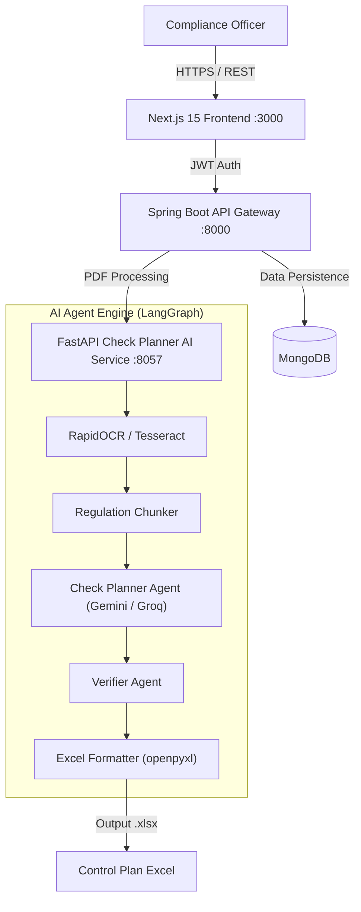

# Architecture

## Request flow

## Three-service topology

- **Frontend** (`frontend/`, Next.js 15): compliance officer-facing dashboard, calls the Spring Boot gateway for auth and orchestration.
- **Gateway** (`backend/`, Spring Boot 3.5): JWT authentication, request routing, and persistence to MongoDB. Sits between the frontend and the Python AI service.
- **AI service** (`check_planner/`, FastAPI): the actual LangGraph multi-agent pipeline — OCR extraction, chunking, generation, verification, Excel formatting.

## Multi-agent pipeline detail

1. **OCR extraction**: RapidOCR (PaddleOCR ONNX runtime) processes the uploaded PDF, with a Tesseract fallback path.
2. **Chunking**: the extracted text is split into regulation-article-sized chunks.
3. **Planner agent**: identifies regulatory articles, objectives, thresholds, and required documentation per chunk, using a quota-aware LLM pool (Gemini primary, Groq fallback, with automatic retry/backoff/rotation across configured API keys).
4. **Verifier agent**: audits the planner's output for consistency and completeness before formatting.
5. **Excel formatter**: renders the verified control plan into a styled `.xlsx` via `openpyxl`.

## Security posture

JWT authentication at the gateway, rate limiting, a 50MB upload size bound, and CORS restricted to configured origins (`ALLOWED_ORIGINS`).
